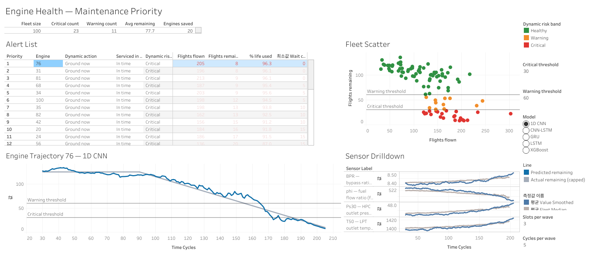
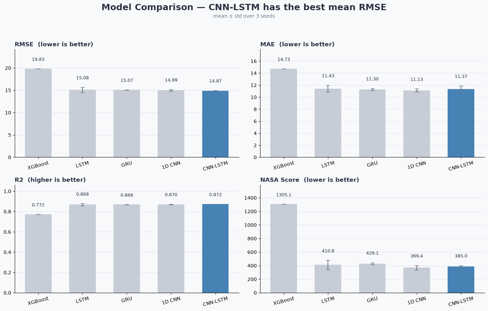
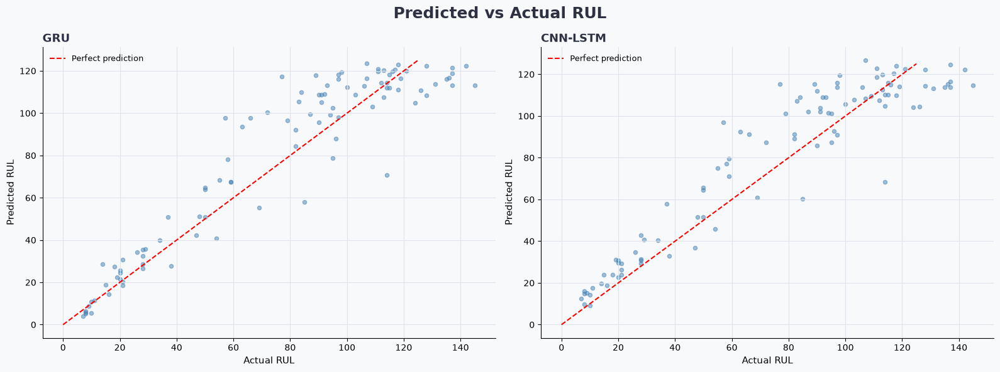
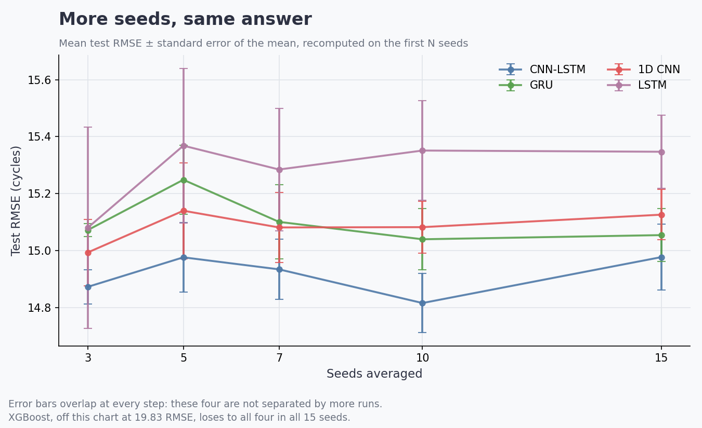
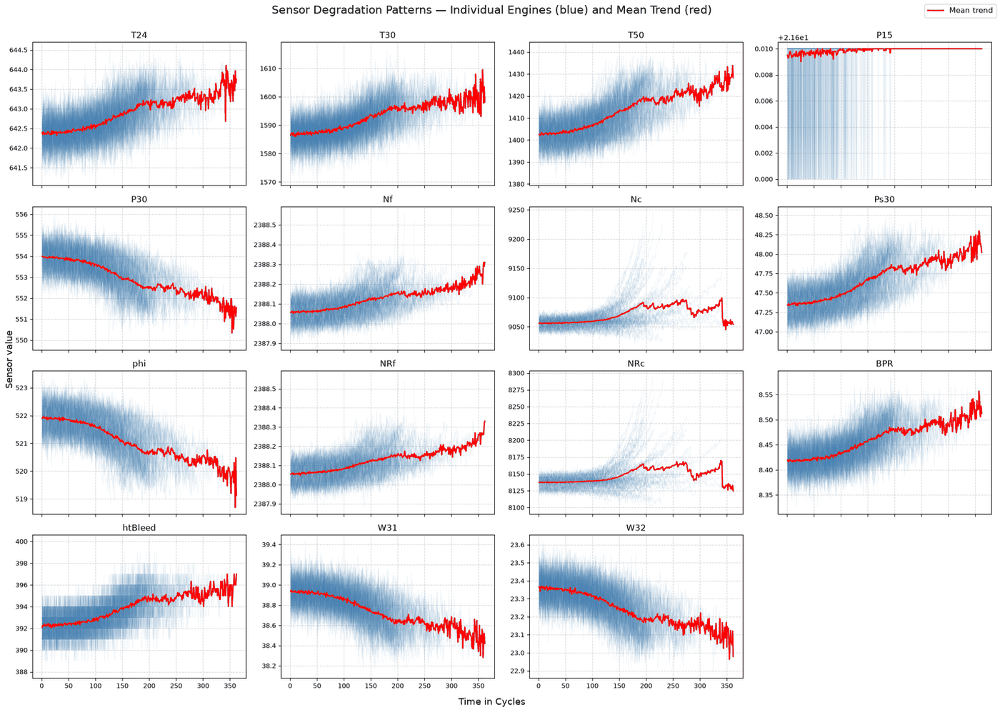

[](https://mybinder.org/v2/gh/hoedongkim/nasa-turbofan-rul/HEAD?labpath=NASA_Turbofan_Jet_Engine_EDA_Predictive_Model.ipynb)
[](https://www.python.org/)
[](LICENSE)

# NASA Turbofan RUL Prediction

**Predicting how many more flights a jet engine has left, from its sensor readings.**

*Solo project — NASA C-MAPSS FD001 dataset.*

[](https://public.tableau.com/app/profile/hoedong.kim/viz/EngineHealthMaintenancePriority/Dashboard1)

*[Open the interactive dashboard →](https://public.tableau.com/app/profile/hoedong.kim/viz/EngineHealthMaintenancePriority/Dashboard1)*

---

## 🎯 Problem

Aircraft engines are serviced on fixed schedules. Service too early and you throw
away usable life; too late and the engine fails in the air. Either way the
schedule is a guess, because it is built around the *average* engine rather than
the one actually on the wing.

A better approach is to ask each engine directly: **how many more flights can you
do?** That number is called **RUL — Remaining Useful Life**, and predicting it
from sensor data is the goal of this project.

## 📊 Data

[NASA C-MAPSS](https://www.nasa.gov/intelligent-systems-division/), subset FD001 —
simulated run-to-failure records for a fleet of turbofan engines.

|  | Engines | Rows | Note |
|---|---|---|---|
| Training | 100 | 20,631 | Each engine flown until it fails |
| Test | 100 | 13,096 | Recording stops *before* failure |

Every row is one flight cycle: **21 sensor readings** (temperatures, pressures,
fan and core speeds, fuel and cooling flows) plus 3 operating settings.

**Target variable:** RUL — the number of flight cycles remaining before failure.
It is **capped at 125** for training, because very early in an engine's life the
sensors look identical whether 200 or 300 flights remain. Capping lets the model
spend its capacity on the wear-down phase, where the signal actually lives. Test
scores are measured against the true, uncapped RUL.

## 🔍 Approach

**1 — Narrow 21 sensors down to 12.** Seven columns turned out to be perfectly
constant, carrying no information at all. Three more (`P15`, `Nc`, `NRc`) were
removed after EDA flagged them (see *Key Insights*), along with two operating
settings that barely correlate with RUL.

**2 — Scale.** Sensor ranges differ by orders of magnitude (`T30` ≈ 1,590 vs
`BPR` ≈ 8.4), so all 12 were min-max scaled to [0, 1]. The scaler is fitted on
training data only and then applied to test — no peeking.

**3 — Compare five models**, chosen to answer one question: *does reading a
sequence beat reading a single snapshot?*

| Model | How it reads the data |
|---|---|
| **XGBoost** | One cycle at a time (baseline). Given 10-cycle rolling mean/std/max so it has some history |
| **LSTM** | 30-cycle window, remembers across the sequence |
| **GRU** | 30-cycle window, lighter recurrent variant |
| **1D CNN** | 30-cycle window, detects local patterns |
| **CNN-LSTM** | CNN extracts local patterns, LSTM tracks them over time |

**4 — Score on four metrics**, because no single one tells the whole story:

| Metric | Why it is here |
|---|---|
| **RMSE** | Punishes large misses heavily; the standard used in C-MAPSS literature, so results are comparable |
| **MAE** | Reads directly as "off by N flights on average" |
| **R²** | How much of the variation in RUL the model explains |
| **NASA Score** | The domain metric, **asymmetric on purpose**: claiming an engine has *more* life than it does is punished far harder than claiming it has less — one wastes a maintenance slot, the other puts a failing engine in the air |

**5 — Re-run everything under three random seeds** to check whether the ranking
is real or an accident of initialisation. This turned out to matter — see
*Takeaways*.

## 📈 Results

Mean ± standard deviation across 15 seeds (42–56):

| Model | RMSE | MAE | R² | NASA Score |
|---|---|---|---|---|
| XGBoost | 19.83 ± 0.00 | 14.73 ± 0.00 | 0.772 | 1305.1 |
| LSTM | 15.35 ± 0.50 | 11.52 ± 0.46 | 0.863 | 451.1 |
| GRU | 15.05 ± 0.36 | 11.31 ± 0.45 | 0.869 | 411.5 |
| 1D CNN | 15.13 ± 0.34 | 11.39 ± 0.38 | 0.867 | 378.7 |
| CNN-LSTM | 14.98 ± 0.45 | 11.68 ± 0.73 | 0.870 | 387.2 |

*No bolding: on RMSE the four sequence models are not separable, so marking a*
*winner would overstate what 15 runs can tell apart.*





The best models land within roughly **15 flight cycles** of the truth. The four
sequence models beat the tabular baseline by about **5 RMSE**, and that gap holds
in every seed.

### How many runs is enough?

Neural networks land somewhere different on every random seed, so any single run
is one draw rather than a result. The question is how many draws it takes before
the picture stops moving — so the study was repeated at 3, 5, 7, 10 and 15 seeds
and the estimates recomputed each time.



The lines barely move. CNN-LSTM has the lowest mean RMSE at every step, but its
error bars overlap its neighbours' at every step too, and a paired comparison
across the 15 seeds separates it from none of them — GRU t = 0.57, 1D CNN
t = 0.99, LSTM t = 2.12, all short of the 2.14 that 15 runs would demand.

The table above reports all fifteen, since they exist. The point of the sweep is
that three would have said the same thing: the extra twelve runs cost an hour of
training and moved no conclusion. That is worth knowing before spending the hour.

What every step does show, unchanged, is the gap to the tabular baseline. All
four sequence models beat XGBoost in **15 of 15 seeds**, by 4.5–4.9 RMSE. That is
the ranking this experiment actually establishes.

## 💡 Key Insights

**1 — The physics is visible in the raw sensors.**



As engines wear out, **temperatures climb** (`T24`, `T30`, `T50`) while
**pressures and fuel flow fall** (`P30`, `phi`, `W31`, `W32`). That is exactly
what a degrading compressor does: it squeezes air less efficiently, so downstream
heat rises and pressure drops. The dataset simulates compressor wear, and the
simulation is faithful enough that the mechanism shows up plainly in the plots —
which is also why a model can learn it.

**2 — The most suspicious sensors were the ones that looked busiest.**

Core speed `Nc` and `NRc` — the two panels that fan out dramatically after ~150
cycles — look like the most dynamic signals on the page. They are traps. Three
independent checks agreed:

- **Correlation** — the two are 0.96 correlated with each other, so one is redundant
- **Stationarity** — flat until ~cycle 150, then the spread explodes for a handful of engines while the rest stay put
- **Outliers** — ~8% outlier rate, four times higher than any sensor that was kept

Meanwhile `P15` (top right) is a flat line: it moves between 21.60 and 21.61 for
the entire life of every engine. A sensor that never changes cannot tell you
anything about change. All three were dropped.

## 🧭 What This Would Mean in Practice

Only what the measured error supports — this is a public research dataset, so
there is no deployment and no real cost saving to report.

With **MAE ≈ 11 cycles** and **RMSE ≈ 15**, a maintenance window opened roughly
**25–30 flights ahead of the predicted failure** would cover the large majority of
engines while still recovering most of the remaining life. The NASA Score is the
metric that would set that margin in practice, since it already encodes the
asymmetry: an over-optimistic prediction is the expensive kind of wrong.

**Is 25–30 flights a useful amount of warning?** In C-MAPSS one cycle is one
flight, and a large narrowbody averages about 3.6 departures a day, so the
window is roughly a week of notice. That is the scale the surrounding logistics
move on: airlines carry spare engines at roughly a 10% ratio precisely because
unscheduled removals cannot be absorbed on the day. What a week buys is the
chance to turn an unscheduled removal into a scheduled one, and so to avoid an
aircraft-on-ground event, commonly estimated at $10,000–150,000 per hour
depending on aircraft and route.

That is a plausibility check against published figures, not a validated lead
time. The right window depends on an operator's spare coverage, shop capacity and
network, none of which C-MAPSS describes.

*Figures from the MIT Airline Data Project, AviTrader, and published
aircraft-on-ground cost estimates.*

## 📌 Takeaways

**A single training run cannot rank models that finish this close.** The first
version of this project concluded CNN-LSTM was the winner, beating GRU by 0.06
RMSE. Re-running under 15 seeds showed that gap was noise — individual runs swing
by half a cycle, and no pair of sequence models separates under a paired test.
Reporting a winner would have meant reporting the seed.

**What the experiment does establish is the comparison it was built for.**
Sequence models beat the tabular baseline by ~5 RMSE, in every seed. Reading the
*trend* in sensor readings, not just their level, is what predicts remaining life.

**When accuracy ties, cost decides.** The 1D CNN trains 4–6× faster than LSTM or
GRU for statistically indistinguishable accuracy — a far better basis for choosing
than the second decimal place of RMSE.

## 🖥 Fleet Health Dashboard

**[→ Open the live dashboard on Tableau Public](https://public.tableau.com/app/profile/hoedong.kim/viz/EngineHealthMaintenancePriority/Dashboard1)**

A maintenance view built on the same predictions — not model metrics, but which
engine needs attention and when. `export_predictions.py` trains all five models,
scores every test engine at every cycle, and writes the results to Postgres plus
`dashboard/rul_predictions.csv`. The dashboard's model switch runs across all
five, so the seed study's "these are tied" conclusion can be checked by hand:
at the default thresholds the critical count moves between 17 and 23 engines
depending on which model is asked.

Engines are banded by predicted remaining life. The 30-cycle threshold is
illustrative, not calibrated. Doing it properly means knowing two things this
project cannot see: what an in-service failure costs relative to pulling an
engine early, and how often engines actually fail at each predicted RUL. Neither
is in C-MAPSS — which is why the threshold is a slider rather than a constant.

| Band | Engines (CNN-LSTM) | Mean error |
|---|---|---|
| Critical (≤30 cycles) | 18 | 5.2 cycles |
| Warning (31–60) | 14 | 8.6 cycles |
| Healthy (>60) | 68 | 14.3 cycles |

Accuracy is highest in the band where a decision actually gets made — a
consequence of capping the training target at 125 cycles, which concentrates
learning on the degradation phase.

"Now" is each engine's last recorded cycle, which is exactly the point the model
was evaluated at, so the dashboard and the notebook report the same numbers.

**What it shows.** Five panels, none of them model metrics:

- **Fleet counts** by risk band, plus how many engines the current maintenance
  capacity can actually reach in time
- **Alert list**, ranked by urgency, with a plain-language action per engine
  (*Ground now* / *Schedule maintenance*)
- **Fleet scatter** placing all 100 engines by flights flown against flights
  remaining, so the wear-out corner is visible at a glance
- **Engine trajectory** — predicted remaining life over that engine's whole
  history, titled with the engine number
- **Sensor drill-down** — the four sensors that drive the prediction, plotted
  against the fleet median at the same age

Clicking any engine, in the alert list or the scatter, drives both bottom panels.

**Thresholds are live.** The alert and warning lines are parameters, not values
baked into the data: the risk band and the recommended action are recomputed in
the workbook, so dragging the 30-cycle slider moves the counts, the scatter
colours, the alert list and every *Ground now* / *Schedule maintenance* label
together.

The grey line on the trajectory chart is the ground truth, shown for validation —
in production only the prediction exists.

### Why is this engine flagged?

The trajectory panel says an engine is nearly out of life; the drill-down says
what the model saw. It plots four sensors — picked by RandomForest importance,
where `Ps30` alone carries 69% and `T50` another 12% — against the median engine
of the same age, over a 10-cycle rolling mean because the raw traces are too
noisy to read a trend off.

Engine 76, first in the queue, is the clearest case. Over its 205 cycles the
exhaust temperature `T50` climbed 25.8 units and compressor outlet pressure
`Ps30` crossed above its peers around cycle 180. The healthiest engine in the
fleet moved 1.4 and 0.0 over the same measures. That is compressor wear showing
up exactly as the physics predicts, and it is the difference between a dashboard
that scores engines and one that explains itself.

The fleet median stops at cycle 198, where fewer than ten engines are still
flying and a median would say more about survivorship than about wear.

### What if we cannot service them all?

Knowing thirty-two engines need attention is not yet a decision — a shop that
handles three engines every five cycles cannot start them all today. Two
parameters describe that capacity, and the workbook queues engines by urgency,
works out how long each waits for its slot, and marks whether its predicted
remaining life survives the wait.

The interesting part is that the answer is not linear:

| Capacity | Serviced in time |
|---|---|
| 0.4 engines/cycle | 8 of 32 |
| 0.6 engines/cycle | 27 of 32 |
| 0.8 engines/cycle | 32 of 32 |

Raising throughput by half takes the fleet from eight engines saved to
twenty-seven. Around that cliff the *In time* and *Too late* labels interleave,
because wait time steps up in blocks while remaining life rises smoothly — engine
77 clears its slot by half a cycle. That is a schedule with no slack in it, which
is itself worth knowing.

**On the data connection.** The pipeline is Postgres-backed end to end:
`export_predictions.py` writes predictions to Neon and `dashboard_views.sql`
defines the two views the dashboard consumes. Tableau Public cannot hold a live
database connection — it has nowhere to store credentials — so the workbook reads
a CSV exported from those views. Pointing Tableau Desktop or Looker Studio at
`cmapss.v_fleet_dashboard` gives the same dashboard over a live connection.

## 📁 Repository Structure

```
├── NASA_Turbofan_Jet_Engine_EDA_Predictive_Model.ipynb   Main analysis (outputs included)
├── cmapss_db.py          Data loader — Neon Postgres, or CMaps/*.txt as fallback
├── seed_study.py         Re-runs every model across seeds -> seed_study.csv
├── seed_study.csv        Per-model, per-seed metrics behind the error bars
├── plot_seed_sensitivity.py  Draws the "does 15 seeds beat 3?" figure
├── upload_to_neon.py     One-off loader: raw text files -> Postgres
├── db_schema.sql         Database schema
├── export_predictions.py Trains all five models, writes predictions
├── dashboard_views.sql   Views the dashboard reads
├── dashboard/            Flattened predictions and sensor traces the workbook loads
├── CMaps/                Raw NASA C-MAPSS data
└── assets/               Figures used in this README
```

The notebook is committed with its outputs — every figure and number renders on
GitHub without running anything. The Binder badge above opens it live, and takes
5–15 minutes to build the first time.

## 🛠 Tech Stack


## License

[MIT](LICENSE)
